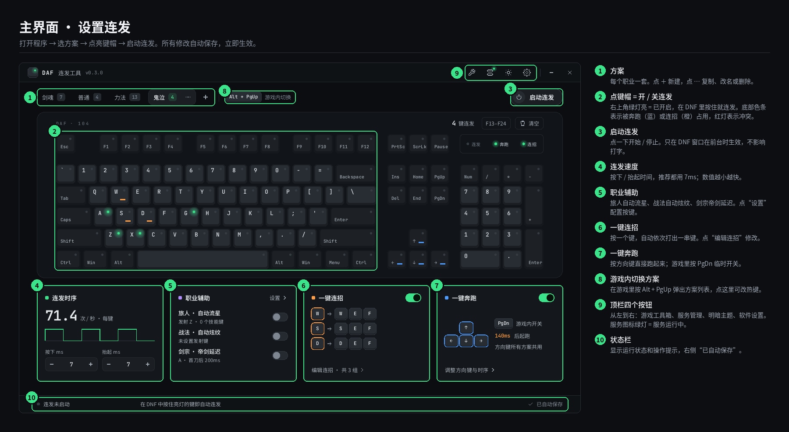
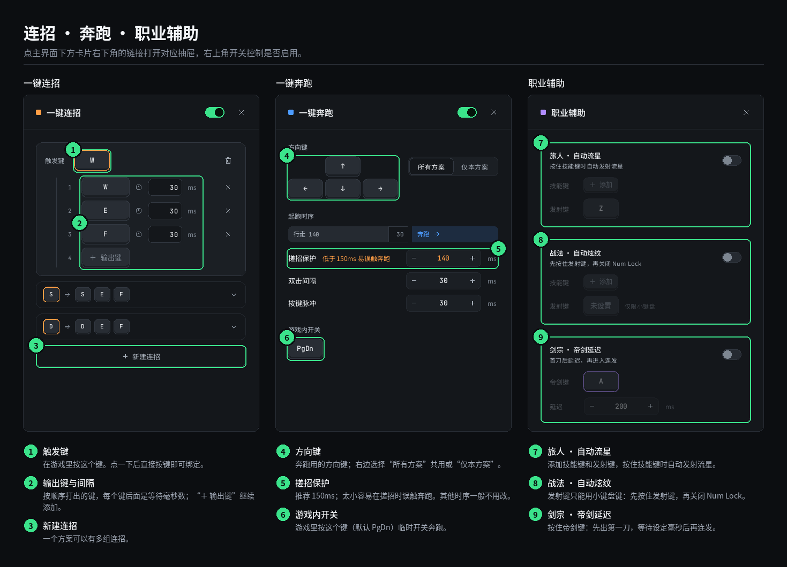
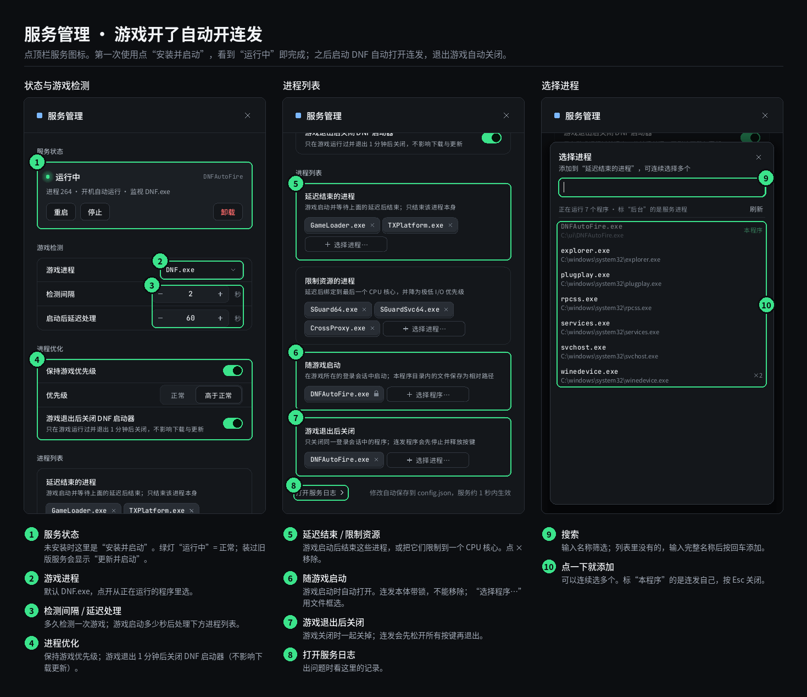
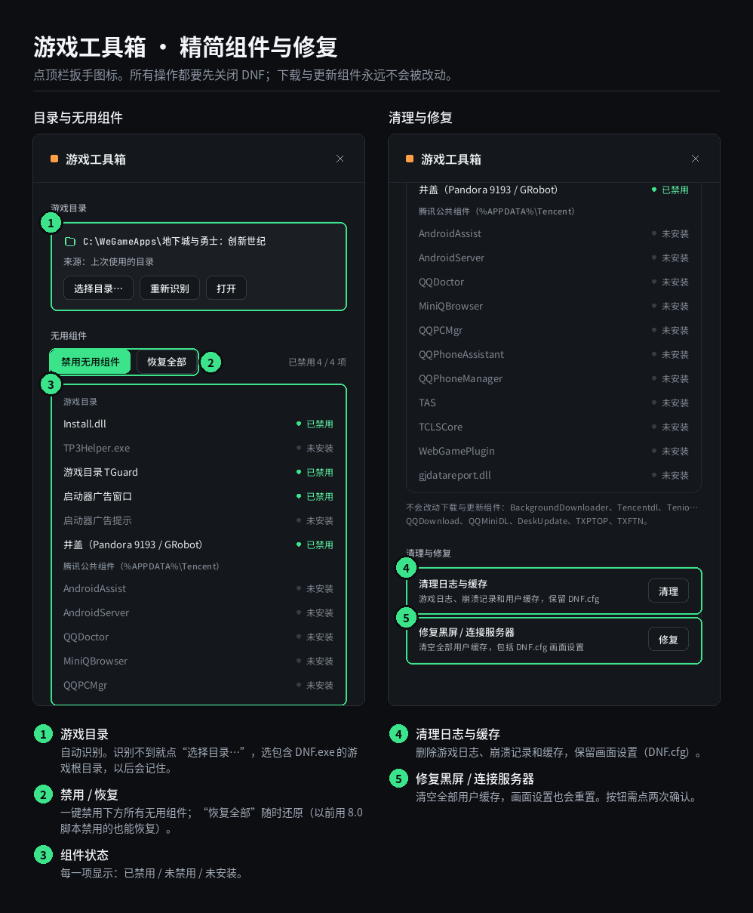
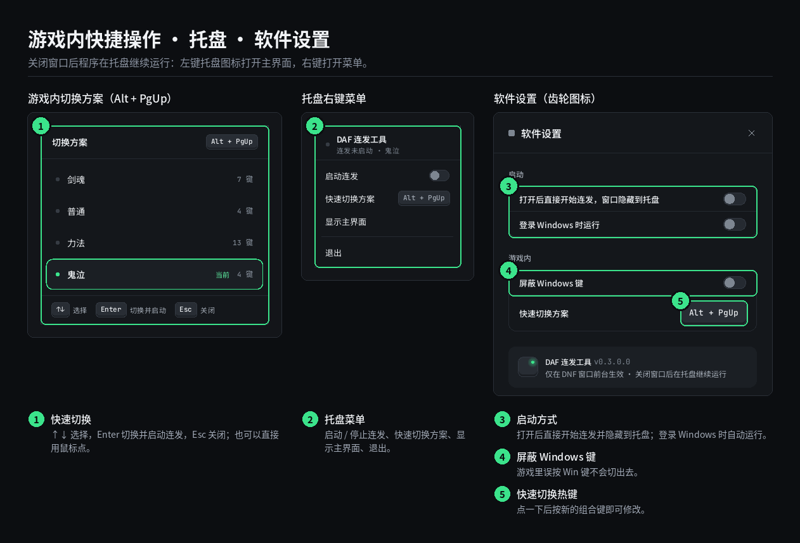

# DAF 连发工具 · 操作手册

适用版本 v0.3.0.4 及以后。一个 `DNFAutoFire.exe` 就是全部：连发、游戏自动化服务、游戏工具箱都在同一个窗口里。

## 30 秒上手

1. 把 `DNFAutoFire.exe` 放进一个固定的文件夹（例如 `E:\autokill`），双击运行，允许管理员权限。
2. 选一个方案 → 点亮要连发的键帽（绿灯）→ 点 **启动连发**。
3. 进入 DNF，按住亮灯的键就会连发。
4. 推荐：点“启动连发”左边的 **后台服务** → **安装并启动**。以后打开 DNF 会自动开连发，退出游戏自动关闭。

> 从旧版升级（AHK 连发 + DNFProcessManager 服务）：**双击新的 `DNFAutoFire.exe`**，在提示里选“升级旧版”。旧服务会换成新的后台服务，`config.ini`、`appsettings.json` 合并成 `config.json`，旧的服务程序、`服务管理.bat` 和工具箱 bat 自动删除，方案和按键全部保留。
>
> 以后有新版本：不用手动替换，**双击下载好的新版本**，在弹出的提示里选“更新已安装的程序”即可；也可以在“后台服务 → 程序版本”点“从文件更新…”。服务和连发会停几秒，完成后自动重新打开，设置不变。

## ① 主界面

连发按下和抬起时间必须大于 0（整数毫秒），默认 7+7ms。低于 7ms 只提示“偏快”，可继续使用；也可设置超过 100ms 的间隔。

## ② 连招 · 奔跑 · 职业辅助

奔跑的搓招保护、双击间隔、按键脉冲均只要求大于 0（整数毫秒）。搓招保护低于 150ms 时保留原有提醒，不会改回 140ms 或 150ms；自定义值保存后再次打开仍保持原值。连续交替按住 ←+↑ 与 →+↓ 时，会先完成新方向的双击再确认奔跑；按住时间短于起跑确认和双击所需时间时仍可能只行走。按住技能键时方向键只行走，技能松开后自动恢复奔跑（连发键、职业技能与连招立即恢复，其他按键按搓招保护重新起跑）；同时按住左右时以后按的方向为准。方向键与连招触发键或职业技能键相同时，该方向改由连招 / 职业使用，奔跑设置中会提示。

## ③ 服务管理

## ④ 游戏工具箱

## ⑤ 游戏内与托盘

在 DNF 窗口里可以直接用热键（v0.3.0.6 起）：

| 热键（默认） | 作用 | 在哪里改 |
| --- | --- | --- |
| **Alt + F12** | 启动 / 停止连发 | 设置 → 游戏内 → 开关连发（右键清除） |
| **F10** | 开关一键奔跑（连发运行时） | 一键奔跑 → 游戏内开关 |
| **Alt + `** | 快速切换方案 | 设置 → 游戏内 → 快速切换方案 |

用热键或托盘菜单开关后，游戏窗口右下角会出现约 2 秒的小卡片：**绿灯 = 已开启，红灯 = 已关闭**。它不会抢走游戏焦点，也挡不住鼠标点击。托盘图标同样是运行中亮绿灯、未启动亮红灯；右键托盘可直接开关连发和一键奔跑。

## 常见问题

| 遇到的情况 | 怎么办 |
| --- | --- |
| 按键没有连发 | 确认：已点“启动连发”（底栏“连发”灯由红变绿）、DNF 窗口在最前面、这个键的键帽绿灯亮着。 |
| 聊天打字受影响 | 不会。连发只在 DNF 窗口在前台时生效，切到别的窗口自动失效。 |
| 奔跑时总误触 / 搓招出不来 | 在“一键奔跑”里把搓招保护调到 150ms 以上；或在游戏里按 F10（奔跑开关热键）临时关闭奔跑。 |
| 游戏里想临时关掉连发 | 按 Alt + F12，右下角提示“连发已关闭”；再按一次重新开启。热键只在 DNF 窗口在前台时生效。 |
| 右下角没看到提示 | 提示是叠在游戏上的小窗口；DNF 使用独占全屏时可能被遮住，改用窗口 / 无边框全屏即可看到。开关本身照常生效，也可看托盘图标的红绿灯。 |
| 后台服务是红灯 | 服务没装或停了。点“后台服务”，再点“安装并启动”或“启动”。 |
| 后台服务是黄灯 | 装的是另一个位置的程序或旧版服务。点“后台服务”，再点“更新并启动”。 |
| 有新版本了怎么更新 | 双击新的 `DNFAutoFire.exe`，选“更新已安装的程序”。直接在文件夹里覆盖会提示文件被占用，因为服务和连发正在使用它。 |
| 想把程序挪到别的文件夹 | 先在“服务管理”点“卸载”，挪好后重新“安装并启动”。卸载不会删除程序和设置。 |
| 删除程序时提示“文件正在使用” | 后台服务正在使用它。打开连发 → 点“后台服务” → “卸载”（再点一次确认）→ 托盘图标右键“退出”，然后再删除。提示框里的服务名也写着这一步。 |
| 工具箱提示先关闭 DNF | 退出游戏后再操作。工具箱只在你点按钮时才改动文件，不会自动执行。 |
| 禁用组件后想还原 | 工具箱里点“恢复全部”。以前用 8.0 脚本禁用的组件也能还原。 |
| 设置丢了吗 | 所有修改自动保存在程序旁边的 `config.json`，更新程序时保留它即可。 |

项目简介见 [README](../README.md)，技术细节见 [架构说明](../native/README.md)。
